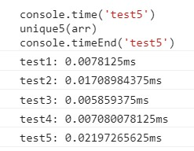

js数组去重是工作中、笔试练习题库中很常遇到的一个简单问题，今天来归纳一番数组去重到底有哪些方案，哪些更高效，分别什么特点；
方案一到方案四是无论数组元素是数字还是字符串都通用的，因为涉及数字的可能需要排序。

<!-- more -->

### 方案一
> 遍历 push 新元素 到 新数组，O(n)，排名：2

1、遍历原数组，把元素push到一个新的空数组temp中
2、做条件判断， 如果temp中已经存在的就不再push了
```
let arr = [1,3,3,8,33,33, 91,91,91,92,100];

const unique = function(arr) {
  let temp = [];
  for(let i = 0; i < arr.length; i++) {
    if(temp.indexOf(arr[i]) < 0) {
        temp.push(arr[i])
    }
  }
  return temp;
}

```
### 方案二
> 因为object的key是唯一的，利用这个特点去重，O(n)，排名：4

1、创建一个object，把数组的每一项作为key；
2、利用Object.keys方法，取key即可
```
let arr = ['red','blue','green','pink','yellow','blue','black','red'];

const unique = function(arr) {
  let obj = {};
  for(let i = 0; i<arr.length;i++) {
    obj[arr[i]] = true;
  }
  return Object.keys(obj);
}


```

### 方案三
> 利用Set, 排名：1

```
const unique = function(arr) {
  return new Set(arr);
}

```

### 方案四
> indexOf()与filter结合使用，O(n)，排名：2
1、filter是返回为true的元素
2、indexOf会返回元素第一次出现的位置
3、利用以上两个特点就有下面的代码

```
const unique = function(arr) {
    return arr.filter(function(item,index,array){
        return array.indexOf(item) === index;
    });
}
```


### 方案五
> 数字元素需要先排序，O(n)，排名：5
1、先排序
2、再利用filter，返回符合true条件的元素
3、条件就是：当前项和后一项不相等的(如2,2,3,4,4,5  => 22相等，23不相等返回2,34不相等返回3，44相等，45不相等返回4，5undefined不相等返回5)

```
const unique = function(arr) {
    return arr.sort(function(a,b){return a-b}).filter(function(item,index,array){
        return item !== array[index+1];
    });
}

```
利用console.time去看执行时间，最快的是方案三，方案一&方案四不相上下，最慢的是方案五；


