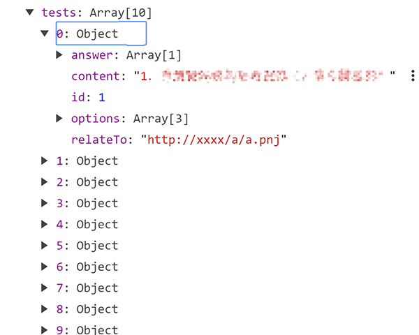
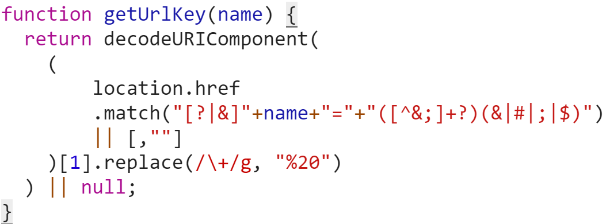
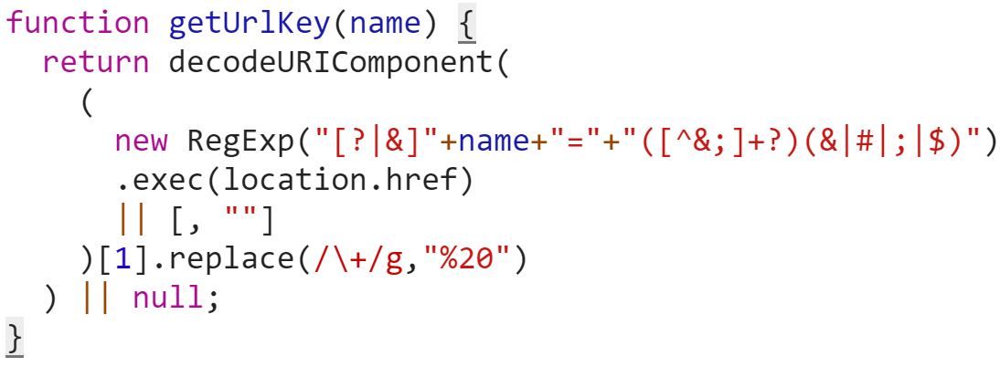
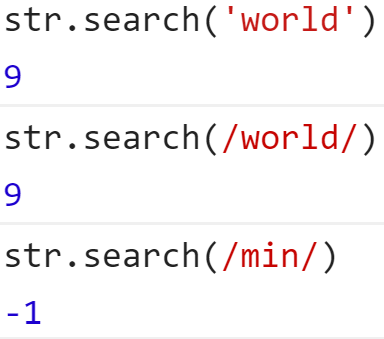
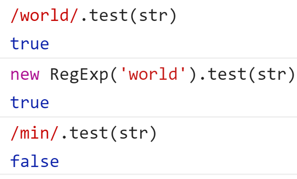

业务代码，可能简单的if-else for循环也就能搞定一些通用逻辑了，但是怎么把简单的代码写的更简洁、可读性更好嘞，想想(￣^￣)...
后来看了网上的一篇文章，感觉颇有收获，就做下笔记，再加上自己日常业务开发遇到的，整理出下篇，嗯。
一起写出可读性更高的代码吧。

<!--more-->
## Case 1，多种条件，不要用 “ || ” 了

题目，如果`fruit`是`apple、strawberry`，则log `red`；
你会怎么写？
```
function test(fruit) {
  if (fruit == 'apple' || fruit == 'strawberry') {
    console.log('red');
  }
}
```
嗯，没什么问题。

进阶，如果是`apple、strawberry、cherry、cranberries`，则log `red`
这样呢？
如果还像上面那样写，if语句就太长了…也太low了吧 是不是！

改进：使用`Array.includes`
```
function test(fruit) {
  // 把条件提取到数组中
  const redFruits = ['apple', 'strawberry', 'cherry', 'cranberries'];

  if (redFruits.includes(fruit)) {
    console.log('red');
  }
}
```
或者使用 `Array.indexOf`
```
function test(fruit) {
  // 把条件提取到数组中
  const redFruits = ['apple', 'strawberry', 'cherry', 'cranberries'];

  if (redFruits.indexOf(fruit) > -1) {
    console.log('red');
  }
}
```
includes兼容性：

## Case 2，多层嵌套
题目，继续上题，加俩条件：
如果没有`fruit`，抛出错误
如果重量(weight)大于10的，则log `good`；
继续写吧
```
function test(fruit, weight ) {
    const redFruits = ['apple', 'strawberry', 'cherry', 'cranberries'];

    // 条件 1：fruit 必须有值
    if (fruit) {
        // 条件 2：必须为红色
        if (redFruits.includes(fruit)) {
          console.log('red');

          // 条件 3：必须质量大于10
          if (weight > 10) {
            console.log('good');
          }
        }
    } else {
        thrownewError('No fruit!');
    }
}
// 测试结果
test(null); // 报错：No fruits
test('apple'); // 打印：red
test('apple', 20); // 打印：red good
```
嗯…看起来好长
有1个`if/else`来筛选无效条件，3个if嵌套，可读性凑合
试想一下，你得滚动到底部才能知道那还有个 `else` 语句，是不是不爽(＃￣～￣＃)

改进：无效条件，优先返回
```
function test(fruit, weight ) {
  const redFruits = ['apple', 'strawberry', 'cherry', 'cranberries'];

  // 条件 1：尽早抛出错误
  if (!fruit) thrownewError('No fruit!');

  // 条件2：必须为红色
  if (redFruits.includes(fruit)) {
    console.log('red');

    // 条件 3：必须是大量存在
    if (weight  > 10) {
      console.log('good');
    }
  }
}
```
这样就少一层嵌套啦(～￣▽￣)～

进一步：不满足条件，就不给往下走
```
function test(fruit, weight ) {
  const redFruits = ['apple', 'strawberry', 'cherry', 'cranberries'];

  if (!fruit) thrownewError('No fruit!'); // 条件 1：尽早抛出错误
  if (!redFruits.includes(fruit)) return; // 条件 2：当 fruit 不是红色的时候，直接返回
  console.log('red');

  // 条件 3：必须是大量存在
  if (weight  > 10) {
    console.log('good');
  }
}
```
思考：以上两种哪种更好？
有人觉得第三种 条件反转会导致更多的思考过程（增加认知负担）。始终追求更少的嵌套，更早地返回，但是不要过度。
但个人觉得第三种理解上不会太困难，而且少了嵌套看起来更舒服。看个人喜欢和习惯？

## Case 3，用Map/Object替代switch
看一段代码：
```
function test(color) {
  // 使用 switch case 来找到对应颜色的水果
  switch (color) {
    case 'red':
      return ['apple', 'strawberry'];
    case 'yellow':
      return ['banana', 'pineapple'];
    case 'purple':
      return ['grape'];
    default:
      return [];
  }
}
//测试结果
test(null); // []
test('yellow'); // ['banana', 'pineapple']
```
上面的代码可以用 对象字面量 来实现：
```
const fruitColor = {
    red: ['apple', 'strawberry'],
    yellow: ['banana', 'pineapple'],
    purple: ['grape']
  };
function test(color) {
  return fruitColor[color] || [];
}
```
或者用Map实现：
```
const fruitColor = new Map()
    .set('red', ['apple', 'strawberry'])
    .set('yellow', ['banana', 'pineapple'])
    .set('purple', ['grape', 'plum']);
function test(color) {
  return fruitColor.get(color) || [];
}

```

## Case 4，使用Array的迭代方法们
### 一
看下面数组：
```
const fruits = [
    { name: 'apple', color: 'red' },
    { name: 'strawberry', color: 'red' },
    { name: 'banana', color: 'yellow' },
    { name: 'pineapple', color: 'yellow' },
    { name: 'grape', color: 'purple' }
 ];
```
Q1：输入color，找到对应color的水果
```
function test(color) {
    return fruits.filter(item => item.color === color);
}
```
Q2: 检查 是否存在红色的水果
```
function test(color) {
    return fruits.some(item => item.color === color);
}
```
Q3，检查 是否所有水果都是红色的
```
function test(color) {
    return fruits.every(item => item.color === color);
}

```

### 二
看下面数据，数组tests和wrongArr：
tests：

wrongArr:   `[3,5,7,8]`
取出数组`tests`中`key`出现过在`wrongArr`中的对象 中的`relateTo`的值；
即返回： `[‘http://xxxx/a/a/pnj’, ‘http://xxx’, ...]`
```
function test(color) {
    return tests.map((item, key)=> wrongArr.includes(key) && item.relateTo)
		.filter(item => item);
}
```
如果不加后面的filter会返回`[false, false, ‘http://xxx’, false, ‘http://xxx’, …]`这样。

## Case 5  正则相关的几个傻傻分不清楚的函数
match()、search()、exec()、test()

|-|	match() |	search() |	exec() |	test()|
|----|---------|---------|---------|---------|
|所属对象	| String|	String|	RegExp|	RegExp|
|函数功能|	提取出匹配项	|验证是否匹配	|提取出匹配项|	验证是否匹配|
|返回值|	返回数组，可通过下标取值|	返回成功匹配的索引或-1|	返回数组，可通过下标取值	|返回true或false|
|Url如下：https://www.baidu.com/s?tn=baidutop10&rsv_idx=2&wd=%E5%8C%97%E4%BA%AC%E5%A4%A9%E6%B0%94%E9%A2%84%E6%8A%A5 取参数方法，eg：||-||-|
|const str = 'Take the world as it is.' (随遇而安。)| - | | - | |

## Case 6, js中获取多层级的对象有什么比较优雅的方式？
比如有个对象：
```
 var obj = {a: {b: {c: 123}}}
```
这时候你要取c的值就得：`a.b.c`。
如果a或者b不存在，那就变成undefined.xxx，然后就会<span style="color: red">报错</span>了！！！

目标：没数据也不报错！

1、`obj && obj.a && obj.a.b && obj.a.b.c`
2、	```
const defaults = {};
(((obj || defaults).a || defaults).b || defaults).c
```

但当业务项目中变量名很长的时候以上两种写法就好长好长啊 (ಥ_ಥ)

3、不介意使用第三方库的话可以用lodash的get：
`_.get(obj, 'a.b.c', 'no data')`

> 提问: 还有什么比较优雅的方式吗？ 欢迎补充！

## 直达
深入讨论 switch 语句和对象字面量的文章：
https://toddmotto.com/deprecating-the-switch-statement-for-object-literals/

参考原文链接：
https://scotch.io/tutorials/5-tips-to-write-better-conditionals-in-javascript


> 此篇不断补充
