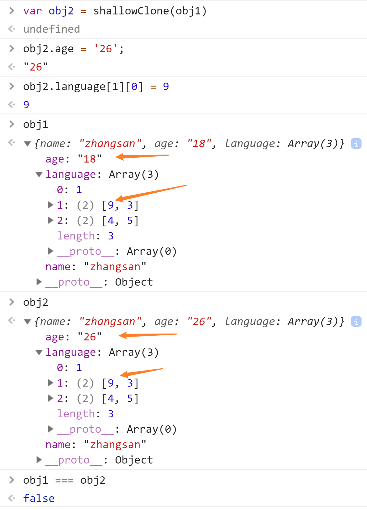
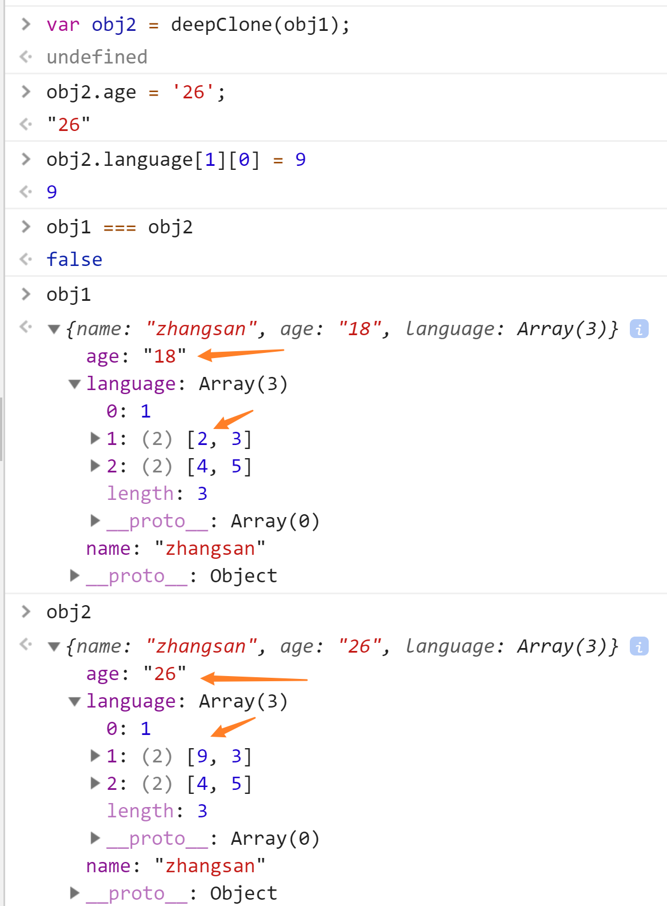
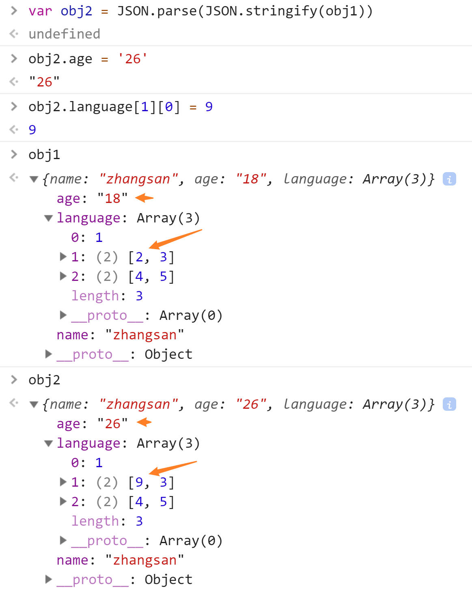
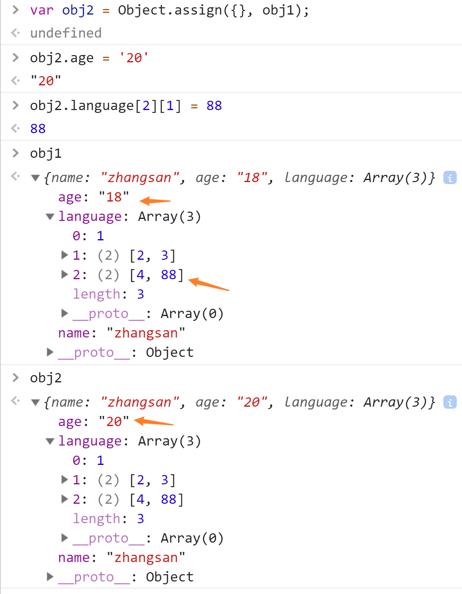
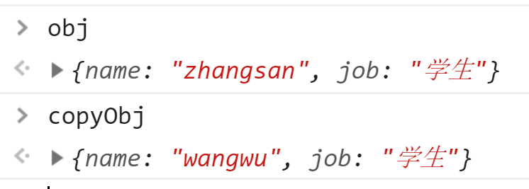
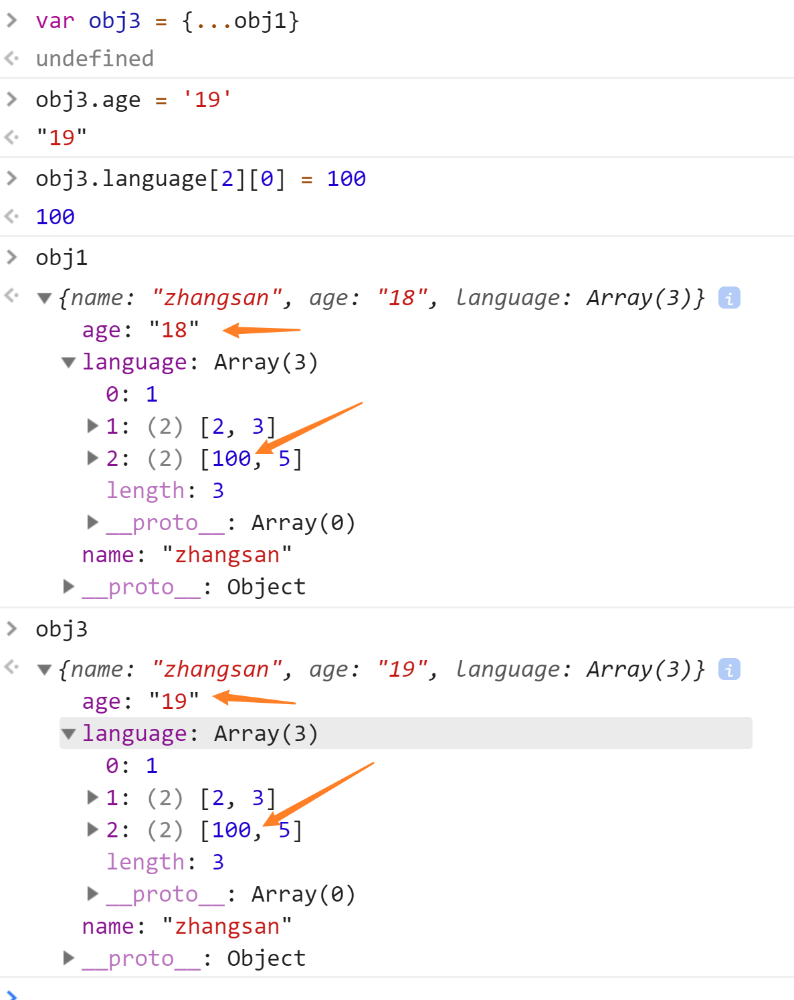
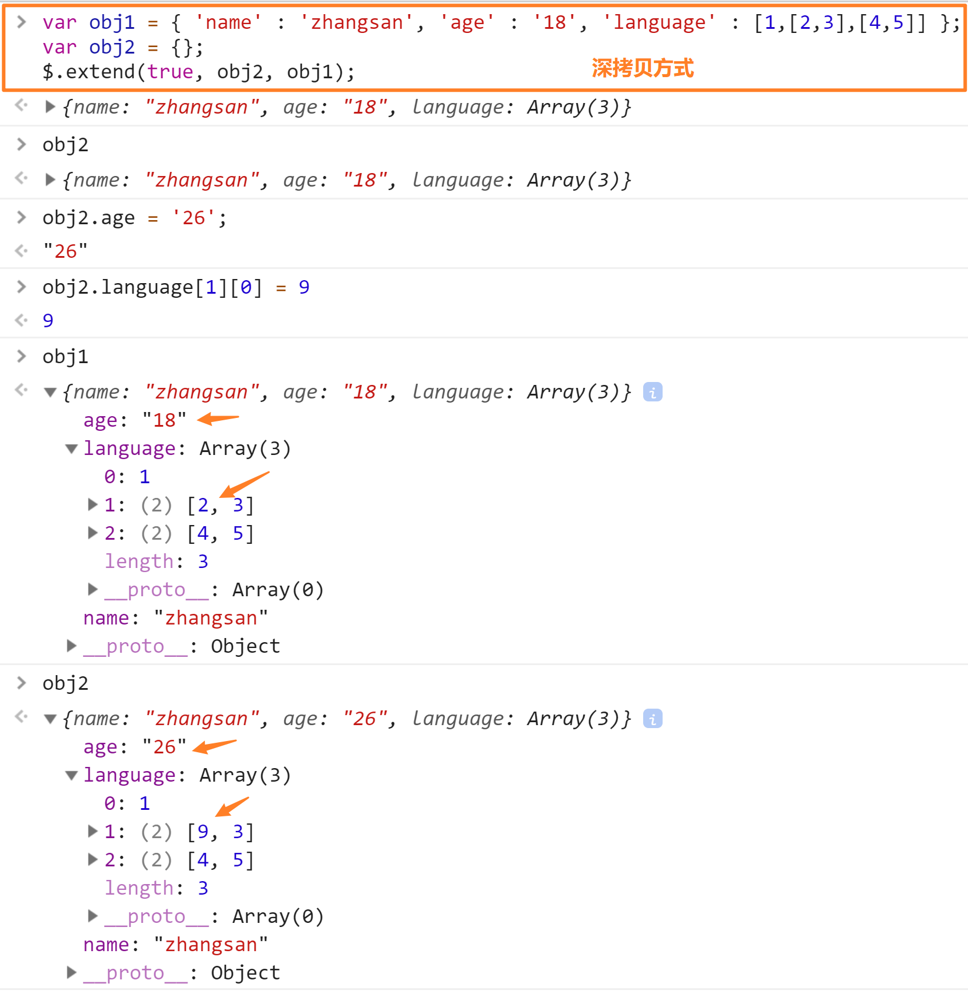
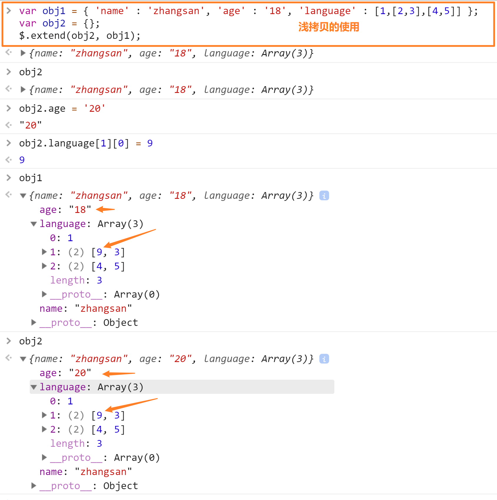

工作中经常会需要拷贝数据，拷贝数据就牵扯到是赋值、浅拷贝还是深拷贝？它们之间的区别是什么？什么场景用？
学习、思考一番之后总结此篇。


<!-- more -->

## 理解
经过学习，我的理解是，
浅拷贝就是把一个对象拷贝一份新的，但是，只拷贝第一层。第一层中 基本数据类型的部分是一份新的，引用数据类型的部分，还是和原来指向同一份，浅拷贝不能拷贝 对象中的子对象
深拷贝也是把一个对象拷贝一份新的，并且是完完全全的一份新的，和源对象不会相应影响，（开辟一块新的内存地址，将原对象的各个属性逐个复制进去）


## 对比
 | 和原数据 是否指向同一对象 | 第一层数据 为基本数据类型 | 原数据中 包含子对象 |
 --|--|--|--|
 赋值| 是 | 改变 会使原数据一同改变 | 改变 会使原数据一同改变
 浅拷贝| 否 | 改变 **不**会使原数据一同改变 | 改变 **会**使原数据一同改变
 深拷贝| 否 | 改变 **不**会使原数据一同改变 | 改变 **不**会使原数据一同改变


## 实现

### 浅拷贝

简单实现

```
function shallowClone(copyObj) {
  if (Object.prototype.toString.call(copyObj)==='[object Object]') {
    var obj = {};
    for ( var i in copyObj) {
      obj[i] = copyObj[i];
    }
    return obj;
  }
  else if (Object.prototype.toString.call(copyObj)==='[object Array]') {
    var arr = copyObj.map(item=>item);
    return arr;
  }
}
```

### 深拷贝

简单实现

```
// 获取数据类型
function getType(obj){
    //tostring会返回对应不同的标签的构造函数
    var toString = Object.prototype.toString;
    var map = {
      '[object Boolean]'  : 'boolean',
      '[object Number]'   : 'number',
      '[object String]'   : 'string',
      '[object Function]' : 'function',
      '[object Array]'    : 'array',
      '[object Date]'     : 'date',
      '[object RegExp]'   : 'regExp',
      '[object Undefined]': 'undefined',
      '[object Null]'     : 'null',
      '[object Object]'   : 'object'
  };
  if(obj instanceof Element) {
        return 'element';
  }
  return map[toString.call(obj)];
}

function deepClone(data){
    var type = getType(data);
    var obj;
    if(type === 'array'){
        obj = [];
    } else if(type === 'object'){
        obj = {};
    } else {
        //不再具有下一层次
        return data;
    }
    if(type === 'array'){
        for(var i = 0, len = data.length; i < len; i++){
            obj.push(deepClone(data[i])); // 递归
        }
    } else if(type === 'object'){
        for(var key in data){
            obj[key] = deepClone(data[key]); // 递归
        }
    }
    return obj;
}
```

❀ 手写深拷贝，给简短点的(利用递归)：
```
function deepCopy(obj) {
    if(typeof obj !== 'object') {
      return obj;
    }
    const newobj = obj.constructor === Array ? [] : {};
    for(let i in obj) {
      newobj[i] = typeof obj[i] === 'object' ? deepCopy(obj[i]) : obj[i];
    }
    return newobj;
}
```
ps:  函数更多的是完成某些功能，有个输入值和返回值，而且对于上层业务而言更多的是完成业务功能，并不需要真正将函数深拷贝。所以不对函数进行过多的考虑；


检验栗子
`var obj1 = { 'name' : 'zhangsan', 'age' : '18', 'language' : [1,[2,3],[4,5]] };`

##### 浅拷贝栗子
<!-- {:height=10 width=10} -->


##### 深拷贝栗子
<!--  -->


## 应用实践
### 拷贝 对象 常用方式

##### 1、JSON.parse(JSON.stringify(xxx))  ——  深拷贝

`var copyObj = JSON.parse(JSON.stringify(obj));`

但是，发现`JSON.stringify()` 有以下几个特点：

- 非数组对象的属性不能保证以特定的顺序出现在序列化后的字符串中。
- 布尔值、数字、字符串的包装对象在序列化过程中会自动转换成对应的原始值。
- undefined、任意的函数以及 symbol 值，在序列化过程中会被忽略（出现在非数组对象的属性值中时）
- 或者被转换成 null（出现在数组中时）。
- 所有以 symbol 为属性键的属性都会被完全忽略掉，即便 replacer 参数中强制指定包含了它们。
- 不可枚举的属性会被忽略

<!--  -->


##### 2、ES6的Object.assign  ——  浅拷贝

```
var obj = {
  name: 'zhangsan',
  job: '学生'
}
var copyObj = Object.assign({}, obj);
copyObj.name = 'lisi';
```

<!--  -->


Object.assign：用于对象的合并，将源对象（source）的所有可枚举属性，复制到目标对象（target），并返回合并后的target
用法： Object.assign(target, source1, source2);

<!--  -->


##### 3、ES6扩展运算符（...） —— 浅拷贝

```
var obj = {
  name: 'zhangsan',
  job: '学生'
}
var copyObj = { ...obj };
copyObj.name = 'wangwu';
```
<!--  -->

扩展运算符（...）用于取出参数对象的所有可遍历属性，拷贝到当前对象之中

<!--  -->


### 拷贝 简单数组 常用的方式

##### 1、slice()  ——   浅拷贝

```
var array = [1, 2, 3, 4];
var copyArray = array.slice();
copyArray[0] = 100;
console.log(array); // [1, 2, 3, 4]
console.log(copyArray); // [100, 2, 3, 4]
```
> slice() 方法返回一个从已有的数组中截取一部分元素片段组成的新数组（不改变原来的数组！）
用法：array．slice(start,end)　start表示是起始元素的下标，　end表示的是终止元素的下标
当slice()不带任何参数的时候，默认返回一个长度和原数组相同的新数组


##### 2、concat()  ——  浅拷贝

```
var array = [1, 2, 3, 4];
var copyArray = array.concat();
copyArray[0] = 100;
console.log(array); // [1, 2, 3, 4]
console.log(copyArray); // [100, 2, 3, 4]
```
> concat() 方法用于连接两个或多个数组 ( 该方法不会改变现有的数组，而仅仅会返回被连接数组的一个副本。)
用法：array.concat(array1,array2,......,arrayN)

以上两个方法对于下面这种复杂数组无效！

`var array = [ { number: 1 }, { number: 2 }, { number: 3 } ];`


#### 其他补充


##### 还可以用lodash的_.cloneDeep(value)

link: [https://lodash.com/docs/4.17.11#cloneDeep](https://lodash.com/docs/4.17.11#cloneDeep)


##### jQuery中的$.extend

语法：`jQuery.extend( [deep ], target, object1 [, objectN ] )`
深浅拷贝对应的参数就是[deep]，是可选的，为true或false。默认情况是false（浅拷贝），并且false是不能够显示的写出来的。如果想写，只能写true（深拷贝）

深拷贝使用：
<!--  -->


浅拷贝使用：
<!--  -->


## 总结
浅拷贝，深拷贝都是拷贝一份新的值，区别在于，源对象中还有子对象时，浅拷贝是没有拷贝的，而深拷贝是递归拷贝的。
所以浅拷贝的源对象和拷贝对象在引用类型数据上是会相互影响的，而深拷贝的源数据和拷贝数据是完完全全不会相互影响的。


参考文章：

[js 深拷贝 vs 浅拷贝](https://juejin.im/post/59ac1c4ef265da248e75892b)

[javascript详解javaScript的深拷贝](https://www.cnblogs.com/penghuwan/p/7359026.html#)
