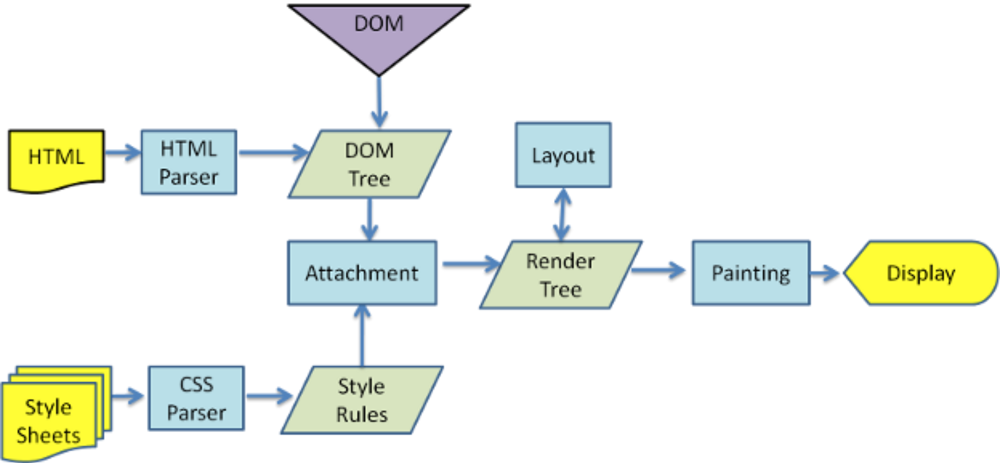
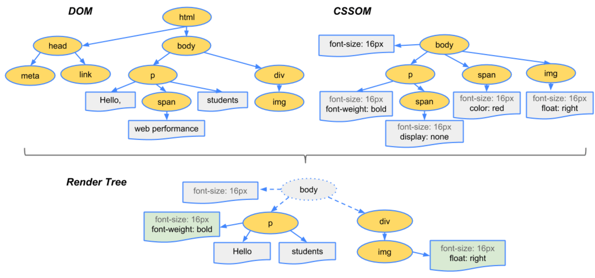

前端面试题集，持续更新。
有不对的地方欢迎指出，感谢


<!-- more -->

# javascript篇

* [原型和原型链](#原型和原型链)
* [作用域和作用域链](#作用域和作用域链)
* [apply,call,bind](#apply)
* [闭包](#闭包)
* [事件委托](#事件委托)
* [事件循环](#事件循环)
* [同源策略](#同源策略)
* [数组去重](#数组去重)
* [web安全](#web安全)


# css篇

* [BFC](#bfc)
* [伪类和伪元素](#伪类和伪元素)
* [position](#position)
* [垂直居中](#垂直居中)
* [两列布局](#两列布局)
* [三列布局](#三列布局)
* [省略号](#省略号)
* [重绘和重排](#重绘和重排)
* [事件循环](#事件循环)
* [同源策略](#同源策略)
* [数组去重](#数组去重)
* [web安全](#web安全)

# 其他
* [http状态码](#http状态码)


### 原型和原型链
> 说说你对原型和原型链的理解

在javascript中，所有对象都有一个 `_proto_` 属性（属性值是普通对象）。其中函数对象都有一个 `prototype` 属性（属性值也是普通对象）。
所有对象的 `_proto_` 属性指向它的构造函数的`prototype`属性。
这个构造函数的`prototype`就是原型。
原型的好处是 某对象 的所有实例对象 都可共享它所包含的属性和方法。

原型链：
当在对象上找某属性时，会先找对象本身。
若没有则找其 `_proto_` ，即其构造函数的原型（`prototype`）
若构造函数的`prototype`上也没有，则找其`_proto_`，即再上一级的prototype
最后的源头，构造函数是Object，找Object.prototype，
如果Object.prototype有就有，没有就是null
原型链的最上层：  Object.prototype.__proto__ === null
这样一直往上找，构成了一个链式结构，就是原型链了

>补充：
构造函数、原型和实例的关系：
每个构造函数都有一个原型对象（xxx.prototype），原型对象都包含一个指向构造函数的指针，
而实例都包含一个指向原型对象的内部指针。
那么，假如我们让原型对象等于另一个类型的实例，结果会怎么样呢？显然，此时的原型对象将包含一个指向另一个原型的指针，
相应地，另一个原型中也包含着一个指向另一个构造函数的指针。
假如另一个原型又是另一个类型的实例，那么上述关系依然成立，如此层层递进，就构成了实例与原型的链条。这就是所谓原型链的基本概念

### 作用域和作用域链
##### [回到顶部](#Javascript篇)

> 说说你对作用域和作用域链的理解

当代码在一个环境中执行时，会创建 变量对象的一个作用域。
作用域链是 多个上下级关系作用域 形成的链，方向是从内到外的。
函数内指向函数外的链式结构称为作用域链。
查找变量就是沿着作用域链来查找的。
用途是 保证 能够有序访问 执行环境中有权访问的 所有变量和函数。（有序访问变量和函数），访问到window对象就被终止。

### apply,call,apply
#### apply
用途：
在特定的作用域中调用函数，实际上等于设置函数体内 this 对象的值。
接收两个参数：一个是 在其中运行函数的 作用域，另一个是 参数数组。
#### call
用途：同apply
接收参数：第一个同apply，其余参数都直接传递给函数
即：传递给函数的参数必须逐个列举出来

对比apply：与apply的区别仅在于接收参数的方式不同。
#### bind
用途： 这个方法会  创建  一个函数的  实例，其 this 值会被绑定到传给 bind() 函数的值。

> call、apply、bind的区别和作用？实现一个bind

这三个方法都可以 改变函数执行时的上下文，再具体一点就是改变函数运行时的this指向。
apply、call是修改函数的作用域（修改this指向），并立即执行。
bind是返回了一个新的函数，不是立即执行。
apply和call的区别在于apply接受数组作为参数，call是接受逗号分隔的无限多个参数列表。

实现bind：
```
Function.prototype.mybind = function(context, ...args) {
  return (...arg2) => {
    this.apply(context, args.concat(arg2))
  }
};
```


##### [回到顶部](#javascript篇)


### 闭包
##### [回到顶部](#javascript篇)

> 什么是闭包？有什么作用？

闭包是指有权访问 另一个函数作用域中的变量 的函数；
通过 函数执行 形成一个 **不销毁的私有作用域**，作用是保存和保护了里面的私有变量，防止污染全局。


### 事件委托
##### [回到顶部](#javascript篇)

> 解释一下事件委托

事件委托就是利用 冒泡的原理，只指定一个事件处理程序，把事件加到父元素或祖先元素上，委托父级代为执行事件，就可以管理某一类型的所有事件。
优点： 提高javascript性能。事件委托可以显著提高事件的处理速度，减少内存的占用。

### 事件循环
##### [回到顶部](#javascript篇)

*一个事件循环有着至少一个任务队列，每个任务队列中都是特定的任务源产生的任务，这些任务源通常都是：事件、回调、I/O操作，DOM操作等，同一个任务队列中的任务严格按照先进先出的顺序执行，不同任务队列的任务执行顺序不一定。任务队列有宏任务和微任务之分。
因为JavaScript在浏览器中特点导致了它只能是的单线程的，这样就导致了Javascript中的并发模型不能像传统语言那样多线程操作。
JavaScript 的并发模型基于"事件循环"。*

> 下面代码的输出结果是什么？

```
console.log(1);
setTimeout(() => {
  console.log(2);

  setTimeout(() => { console.log(3) });

  new Promise(function (resolve) {
    console.log(4);
    resolve();
  }).then(function () {
    console.log(5);
  }, 1000);
})

async function async1() {
  console.log(6);
  await async2();
  new Promise(function (resolve) {
    console.log(7);
    resolve();
  }).then(function () {
    console.log(8);
  });
  console.log(9);
}

new Promise(function (resolve) {
  console.log(10);
  resolve();
}).then(function () {
  console.log(11);
});

async function async2() {
  console.log(12);
}

setTimeout(() => {
  console.log(13);
  new Promise(function (resolve) {
    console.log(14);
    resolve();
  }).then(function () {
    console.log(15);
  });
})

async1();
console.log(16)
```

需要关注的几点：
1、创建promise对象里面的代码属于同步代码
2、promise的then/catch才是异步，需进入任务队列
3、setTimeout也会进入任务队列，但是和promise的then/catch似乎不是同一队列，优先级低于 then/catch 的
4、遇到await的，eg: await async2(); async2会立刻执行，但是，紧接着await会让出当前线程，将后面的代码加到任务队列中。


>答案：1 10 6 12 16 11 7 9 8 2 4 5 13 14 15 3


再做一题了解async和promise的执行顺序：
```
async function async1() {
  console.log('async1');
  await async2();
  console.log('async100');
}
async function async2() {
  console.log('async2');
}
async1();
new Promise(function (resolve) {
  console.log('promise');
  resolve();
}).then(function () {
  console.log('promise2');
});
```
...
...
...
...
...
...

> 答案： async1 async2 promise async100 promise2

### 同源策略
##### [回到顶部](#javascript篇)

> 解释一下同源策略

同源策略是由Netscape提出的一个安全策略。指一个域下的页面中，无法通过ajax请求获取到其他域的接口数据。
同源指协议、域名、端口号相同。
目的是 防止某个文档或脚本从多个不同源装载。保证用户信息的安全，防止被恶意网站窃取敏感数据（例如，登录态的cookie）。

### 数组去重
##### [回到顶部](#javascript篇)
法一：
```
function unique(arr) {
    const temp = [];
    arr.forEach(item => {
        if (temp.indexOf(item) === -1) {
            temp.push(item);
        }
    })
    return temp
}
```
`知识点：遍历, indexOf`

法二：
```
function unique (arr) {
   return Array.from(new Set(arr))
}
```
`知识点：Set`

### web安全
> 说说常见web安全及防护原理

①. xss(跨站脚本攻击)，原理是 攻击者 往web页面里面 插入恶意可执行网页脚本代码，使得其他用户浏览该网页时受影响。
防御： 转义输入输出的内容。

②. csrf(跨站请求伪造)，是 一种攻击者盗用用户在当前已登录的web页面上的身份信息执行非本意的操作（模拟发送请求）的攻击方式


### bfc
##### [回到顶部](#css篇)
> 请阐述 BFC (块格式化上下文Block Formatting Context) 及其工作原理。


### position
##### [回到顶部](#css篇)

#### static
默认值，即没有定位，元素出现在正常的流中。即使设置了top，bottom,left,right也没有任何用。

#### fixed
指元素的位置 **相对于浏览器窗口是固定位置**，即使窗口是滚动的它也不会滚动，且fixed定位使元素的位置与文档流无关，因此不占据空间，且它会和其他元素发生重叠。

#### relative
相对定位，元素的定位是 相对它自己 的正常位置的定位。

#### absolute
绝对定位，元素相对于 **最近的已定位父元素**，如果元素没有已定位的父元素，那么它的位置相对于<html>。

##### 延伸：position:absolute 和 z-index
设置了`position: absolute;`之后的元素在z轴方向上的优先级就大于文档流中的元素，即使文档流中的元素设置了很高的z-index也没用。

z-index 只在大家都是文档流中的元素或大家都是absolute的时候生效；

### 伪类和伪元素
##### [回到顶部](#css篇)

### 垂直居中
##### [回到顶部](#css篇)


### 两列布局
##### [回到顶部](#css篇)
> 写一个左侧固定200px，右侧自适应布局

1、左边左浮动，右边设置margin-left:200px；
2、左边绝对定位，右边设置margin-left:200px；
3、右侧元素设置顶线和右线的位置为0， 左线位置为200px，宽度为100%；

<!-- ### 三列布局
##### [回到顶部](#css篇) -->


<!-- 某模块的宽度自适应，高度是宽的的2倍； -->

### 省略号
单行省略号
```
.xxx {
  white-space:nowrap;
  overflow:hidden;
  text-overflow:ellipsis;
  width：100px;
}
```

多行省略号：
```
.xxx {
  display: -webkit-box;
  -webkit-box-orient: vertical;
  -webkit-line-clamp: 3;
  overflow: hidden;
}
```
方法二：
```
p{
  position: relative;
  line-height: 20px;
  max-height: 40px;
  overflow: hidden;
}
p::after {
  content: "...";
  position: absolute;
  bottom: 0;
  right: 0;
  padding-left: 40px;
  background: -webkit-linear-gradient(left, transparent, #fff 55%);
  background: -o-linear-gradient(right, transparent, #fff 55%);
  background: -moz-linear-gradient(right, transparent, #fff 55%);
  background: linear-gradient(to right, transparent, #fff 55%);
}
```

### 重排和重绘
##### Reflow —— 回流(重排)

计算渲染树 在设备视口内的 确切位置和大小, 这就是“布局”阶段，这个计算的阶段就是回流。
布局流程的输出是一个“盒模型”，它会精确地捕获 每个元素在视口内的确切位置和尺寸：所有相对测量值都转换为屏幕上的绝对像素。

##### Repaint —— 重绘
通过 渲染树和回流阶段，我们知道了哪些节点是可见的，以及可见节点的样式和具体的几何信息(位置、大小)，
那么我们就可以将渲染树的每个节点都 转换为 屏幕上的实际像素，这个阶段就叫做重绘节点。

浏览器渲染流程：
1. 解析 HTML，构建 DOM 树。
2. 解析 CSS，构建 CSSOM 树。
3. 将 DOM 与 CSSOM 合并成一个渲染树(Render Tree)。
4. Layout(回流): 根据渲染树来布局(Layout)，以计算每个节点的几何信息(位置，大小)。
5. Painting(重绘)：根据渲染树以及回流得到的几何信息，得到节点的 绝对像素。
6. Display: 将像素发送给GPU，展示在页面上。（这一步其实还有很多内容，比如会在GPU将多个合成层合并为同一个层，并展示在页面中。而css3硬件加速的原理则是新建合成层。）


> 何时触发回流和重绘

repaint重绘：
- reflow回流必定引起repaint重绘，重绘可以单独触发
- 背景色、颜色、字体改变（注意：字体大小发生变化时，会触发回流）

reflow回流：
- 页面第一次渲染（初始化）
- DOM树变化（如：增删节点）
- Render树变化（如：padding改变）
- 字体大小发生变化
- 内容发生变化，比如文本变化或图片被另一个不同尺寸的图片所替代
- 浏览器窗口resize
- 当你查询布局信息，包括offsetLeft、offsetTop、offsetWidth、offsetHeight、 scrollTop/Left/Width/Height、clientTop/Left/Width/Height、调用了getComputedStyle()或者IE的currentStyle时，浏览器为了返回最新值，会触发回流。

注意：回流一定会触发重绘，而重绘不一定会回流（看上面的流程图就知道了）

生成渲染树：

看上图，`display:none`的span整合到render tree里的时候就没了.

请注意 visibility: hidden 与 display: none 是不一样的。前者隐藏元素，但元素仍占据着布局空间（即将其渲染成一个空框），而后者 (display: none) 将元素从渲染树中完全移除，元素既不可见，也不是布局的组成部分。


名词解释：
###### GPU
图形处理器(Graphics Processing Unit),显卡的处理器，它是显卡的“心脏”。
时下的GPU多数拥有2D或3D图形加速功能。如果CPU想画一个二维图形，只需要发个指令给GPU，如“在坐标位置（x, y）处画个长和宽为a×b大小的长方形”，GPU就可以迅速计算出该图形的所有像素，并在显示器上指定位置画出相应的图形，画完后就通知CPU “我画完了”，然后等待CPU发出下一条图形指令。


### http状态码
状态码 | 含义 | 详解
---|---|---
2xx|
200|OK|响应成功(从客户端发来的请求被服务器端正常处理了)
202||服务器已接受请求，但尚未处理
204|No Content|请求处理成功，但无资源可返回
206|Partial Content|客户端进行部分请求，服务器已成功处理了这部分GET请求
3xx|
301|Moved Permanently|永久性重定向，请求的资源已被永久的分配了新的URI(书签是要更新的)
302|Found|临时性重定向，请求的资源临时被分配了新的URI
304|Not Modified|客户端带着附带条件(If-Modified-Since之类)发请求，未满足条件时，服务器资源也未变，可直接使用客户端未过期的缓存。
4xx|
400|Bad Request|请求报文中存在语法错误
401|Unauthorized|发送的请求需求有 通过HTTP认证的 认证信息。
403|Forbidden|请求资源的访问被服务器拒绝了(没权限访问)
404|Not Found|服务器上无法找到请求的资源(没找到资源)
5xx|
500|Internet Server Error|服务器在执行请求时发生了错误(服务端出bug了之类)
502||错误网关，服务器作为网关或代理，从上游服务器接收到无效响应
503|Service Unavailable|服务器暂时处于超负载或正在进行停机维护，现在无法处理请求(服务不可用)