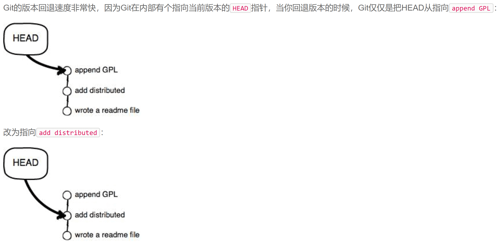

### 版本控制系统对比

| git   | svn   |
| ----- | ----- |
| 分布式 (每个人电脑上都是一个完整的版本库)| 集中式 (版本库集中存放在中央服务器)  |
|安全性高 (任何一个人电脑挂掉还可以从其他电脑重新拉取)|安全性低 (中央服务器挂掉就完了)|
|无需联网也能工作 (在本地工作不用考虑远程库的存在，有网络时再把本地代码推送即完成同步代码)|必须联网才能工作 |
|有暂存区的概念||

### git 命令
- 查看历史
`git log`
 简化的历史
`git log --pretty=oneline`

- 回退版本
  `git reset --hard HEAD^`
  >上一个版本就是 `HEAD^` ，上上一个版本就是`HEAD^^`，当然往上100个版本写100个^比较容易数不过来，所以写成`HEAD~100`;

  指定回到未来某版本：
  `git reset --hard 1094axxxxx`(这是commit id)

  > HEAD指向的就是当前版本

- 查看命令历史(之前都敲了下啥命令)
`git reflog`

- 把文件添加到暂存区
`git add xx`

- 把暂存区的内容提交到当前分支
` git commit -m "messagexx"`

- 查看工作区状态
` git status`

> Git跟踪并管理的是修改，而非文件（什么是修改？比如你新增了一行，这就是一个修改）

- 查看工作区和版本库里面最新版本的区别
`git diff HEAD -- readme.txt`

- 撤销修改（丢弃工作区的修改）
`git checkout -- readme.txt`
【撤销到最后一次git add 或 git commit（无add时就commit）时的状态】

- 取消add
`git reset HEAD <file>（HEAD表示最新的版本）`
- 删除文件（要从版本库中删除该文件）
`git rm test.txt`

- 如果手动删错文件了，恢复误删
`git checkout -- test.txt`

- 本地有个代码库learngit，github 上new 了一个仓库，那么可以用下面命令来让使之关联起来：
`git remote add origin git@github.com:[github账户名]/learngit.git`

- 然后就可以把本地代码库推到github远程库上了：
`git push -u origin master`

>上面的命令加上了-u参数是因为第一次推送， 你可能还不想把内容推上去，只是想把本地master和远程关联，后面推代码就不用-u了

