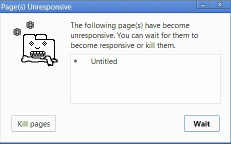
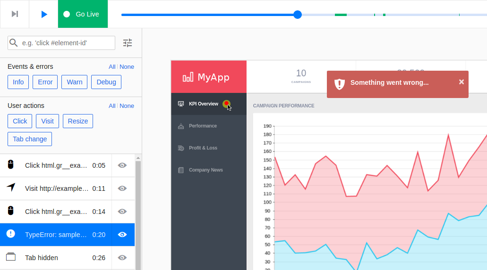

为了深入学习和了解js是如何工作的，翻译此篇。

原文地址：[How JavaScript works: an overview of the engine, the runtime, and the call stack](https://blog.sessionstack.com/how-does-javascript-actually-work-part-1-b0bacc073cf)

<!-- more -->

正文开始，

随着 JavaScript 变得越来越流行，团队可以把它应用在前端，后端，混合应用程序，嵌入式设备等等多方向上。

本文旨是系列中的第一篇，旨在深入挖掘 JavaScript 是如何工作的：我们认为通过了解 JavaScript 的 building blocks 以及它们是如何一起运行的可以使你写出更好的代码和应用程序。我们也会分享一些我们在构建 SessionStack 时使用的一些经验规则，这是一个轻量级的，强大且高性能保持竞争力的 JavaScript 应用程序。

正如 [GitHut](https://githut.info/) 统计数据显示， JavaScript 在GitHub 仓库中的活跃程度和总push量处于领先地位。其他的衡量指标也不落后。


如果项目对 JavaScript 的依赖很大，这意味着开发者必须利用任何语言和生态系统提供的所有东西，对内部进行更深入的了解，以便构建更出色的软件。

事实证明，很多开发者每天都在使用 JavaScript ，却不了解背后的原理。

## 概览
几乎每个开发者都已经听过 V8 引擎这个概念，也有很多人知道 JavaScript 是单线程的或它使用的是回调队列；

在本篇文章中，我们将详细介绍所有这些概念，并解释 JavaScript 实际上是如何运行的。通过了解这些细节，你能正确利用提供的API写更好的、非阻塞的应用程序。

如果你是个 JavaScript 小新，那么这篇文章将帮助你理解为什么 JavaScript 相比其他语言会如此“神奇”。

如果你是一个经验丰富的 JavaScript 开发者，希望它会给你一些新鲜的视角去认识 你每天使用的 JavaScript 它的 运行时的实际工作原理。


## JavaScript 引擎
JavaScript 引擎的一个流行的示例是 Google 的 V8 引擎。V8 引擎应用在Chrome和Node.js上。下面是 V8引擎的一个非常简化的示图：


引擎主要由两个组件组成：
- 内存堆 —— 这是内存分配发生的地方
- 调用栈 —— 这是你的代码执行时 栈帧的位置（ 回调函数将会在这里执行）

## 运行时
那些 可以被 Javascript 开发者在浏览器经常使用到的 API （例如setTimeout），并不是由 Javascript 引擎提供的。

所以，这些 API 怎么来的？
事实证明，实际有些复杂。


所以，我们有引擎，但是实际上还需要很多。
我们有一些叫做Web APIs 的东西，它们是浏览器提供的，比如DOM，AJAX，setTimeout 等等。

然后，我们还有流行的事件循环（event loop ）和回调队列（callback queue）。

## 调用栈
Javascript 是一种单线程的编程语言，意味着它只有一个调用栈（call stack），因此它某一时刻只能做一件事情。

调用栈是一种数据结构，它主要记录程序执行到哪了。当 js 的虚拟机 执行一个函数时，就会把这个函数推到调用栈中，当这个函数执行到return了或者执行完毕了，这个函数就会出栈，从调用栈中删除。
来看一个栗子，看看下面的代码：
```
function multiply(x, y) {
    return x * y;
}
function printSquare(x) {
    var s = multiply(x, x);
    console.log(s);
}
printSquare(5);
```
当引擎刚开始执行这段代码时，调用栈为空，之后，步骤如下：


调用栈中的每个条目成为栈帧。

这正是抛出异常时 栈追踪记录的构造方式。 —— 它基本上是异常发生时调用栈的状态。
看看下面的代码：
```
function foo() {
    throw new Error('SessionStack will help you resolve crashes :)');
}
function bar() {
    foo();
}
function start() {
    bar();
}
start();
```
如果在Chrome执行此代码（假设这段代码在文件foo.js中）则将生成以下栈追踪记录：


“栈溢出” —— js引擎产生的栈 超过 js运行环境所提供的最大数量时 会发生这种情况。如果你使用递归且没有充分的测试你的代码时，这可能很容易发生。看看下面这段示例代码：
```
function foo() {
    foo();
}
foo();
```
当引擎开始执行这段代码时，它开始调用函数“foo”，然而这个函数在并没有任何终止条件的情况下开始递归调用自己，因此在执行的每个步骤中，相同的函数会一遍又一遍地添加到调用栈中，它看起来像这样：


然而在某些时候， 调用栈中函数调用的数量超过了调用栈实际大小，浏览器决定通过抛出错误来处理这个情况，该错误看起来像这样：


在单个线程上运行代码非常简单，因为你不需要处理多线程环境中出现的复杂的场景 —— 例如，死锁。

但是在单线程上运行也是非常有限的，由于 Javascript 只有一个调用栈，应对复杂调用时，什么会使限制程序性能使其变慢？

## 并发 & 事件循环
如果在调用栈中有函数调用需要花费大量时间，那会发生什么？例如，假设你想在浏览器中使用js进行一些复杂的图像转换。

你可能会问 —— 为什么这是个问题？ 问题是，虽然调用栈有函数执行功能，但浏览器实际上无法执行任何操作 —— 它会被阻塞，这意味着浏览器无法渲染，它无法运行任何其他代码，它只是卡主了，如果你想在应用中使用流畅的UI，这会产生问题。

这不是唯一的问题。一旦你的浏览器开始在调用栈中处理如此多的任务，他可能会在相当长的时间内停止响应。大多数浏览器通过抛出错误提示信息来处理，询问你是否要终止网页。



现在，那不是最好的用户体验，是吗？
那么，我们如何在不阻塞UI并使用浏览器无响应的情况下执行繁重的代码呢？好吧，解决方案是异步回调。

这将在“如何实际运行Javascript”教程的第2部分中进行更相信的解释：“在V8引擎内部+有关如何编写优化代码的5个技巧”。
> 后面的部分 好像就是广告了..

与此同时，如果你在 Javascript 应用程序中难以复制和理解问题，请查看 SessionStack 。SessionStack记录Web应用程序中的所有内容：所有DOM更改，用户交互，Javascript异常，栈跟踪，失败的网络请求和调用消息。

使用 SessionStack ，你可以将网络应用中的问题作用视频重播，并查看用户发生的所有事情。


