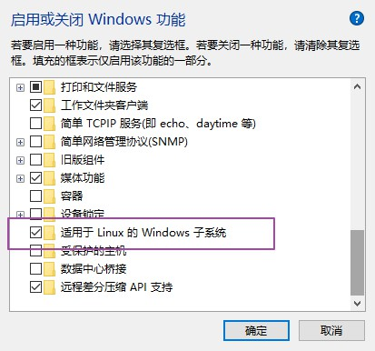

搞了个服务器，ubuntu的，尝试用win10的bash连接，后来感觉终端的一些配色不是很合适，看得眼睛累，就尝试改改，期间还遇到很多问题，在此做做笔记。

<!-- more -->

### win10的bash使用ssh连接远程服务器
#### 安装
Win10加入了Ubuntu Bash命令支持，本来windows连接远程服务器的话要使用xshell、putty什么的，现在可以用这个了。

1、 设置 -> 安全和更新 -> 开发者选项, 选择开发人员模式

2、 控制面板 -> 程序和功能 -> 启用或关闭windows功能, 勾上“适用于Linux的Windows子系统”

3、重启电脑
4、在Microsoft Store里安装Ubuntu（或其他子系统）

5、安装好之后打开ubuntu终端，会让你设置用户名密码
6、以后想进入bash，有以下几种方法：
  - win+R -> 输入 bash
  - 打开cmd终端，在输入bash回车
  - 小娜的搜索栏输入 bash 回车
  - 直接打开ubuntu终端

#### 连接
1、 进入bash
2、 输入 ssh 用户名@域名/ip 回车
3、 输入 服务器密码 回车

#### 上传下载

##### 上传

1、 进入bash
2、  传文件的话，输入 scp 文件 用户名@域名/ip:目标路径 ，比如我将桌面的1.txt传到服务器的/home/zm/test 地址下，先进入桌面：
`cd /mnt/c/Users/Sameen/Desktop`

再进行上传：
` scp test.txt zm@39.xxx.xxx.39:/home/zm/test`

3、同理，传文件夹的话： scp -r 文件夹 用户名@域名/ip:目标路径

##### 下载
1、 下载文件：
scp 用户名@域名/ip:远程文件的地址 本地地址

2、 下载文件夹：
scp -r 用户名@域名/ip:远程文件夹的地址 本地地址

### ubuntu终端个性化
##### 改变文件夹颜色
1、 利用dircolors命令，查看我们的系统当前的文件名称显示颜色的值，然后利用管道重定向到用户目录下的任意一个文件（这里我们创建了一个.dir_colors文件）
    ① cd ~
    ② dircolors -p > .dir_colors
2、 用vim打开.dir_colors文件，然后找到“DIR 01;34”   //这里的01表示高亮度显示，34表示蓝色，33表示黄色
    修改为 “DIR 01;33”，保存退出
3、 为了将修改之后的配置文件导入到dircolors中，我们采取如下的方案
    打开用户目录下的.bashrc文件，找到类似“eval 'dircolors -b '”（如果没有自行添加），
   修改为 eval 'dircolors -b .dir_colors'   保存退出   //这里的.dir_colors就是我们前面自己创建的文件
4. 为了让修改生效，退出，并重新进入系统
命令： exit
搞定~

##### 改变路径的颜色：
1、vim ~/.bashrc

2、找到关键词 PS1 找到这句话：

3、把01:34 （蓝色）改成01:33（黄色）
搞定~

- 补充：

样式： 
00 — Normal (no color, no bold) 
01 — Bold    //粗体
文字颜色 
30 — Black   //黑色
31 — Red     //红色
32 — Green   //绿色
33 — Yellow  //黄色
34 — Blue    //蓝色
35 — Magenta //洋红色
36 — Cyan    //蓝绿色
37 — White   //白色
背景颜色 
40 — Black 
41 — Red 
42 — Green 
43 — Yellow 
44 — Blue 
45 — Magenta 
46 — Cyan 
47 – White
白色：    表示普通文件
蓝色：    表示目录
绿色：    表示可执行文件
红色：    表示压缩文件
蓝绿色：  链接文件
红色闪烁：表示链接的文件有问题
黄色：    表示设备文件
灰色：    表示其他文件

##### 遇到的问题
1、ubuntu 修改保存报错E37:No write since last change(add ! to override)
解决办法：
  在修改完后，将命令    :q    改成    :wq    即可。

2、用Vim编辑文件时出现E325: ATTENTION错误的解决方法
解决方法：
  可以在上面出现的提示中按D,将临时文件删除掉

### linux命令学习
1、不保存退出：    :q!
2、Linux如何对文件内容中的关键字进行查找
  如果是用vi打开文件后，在命令行下输入“/关键字”
  如果你要继续查找此关键字，敲字符 n 就可以继续查找了。 
  敲字符N（大写N）就会向前查询； 

### 文件了解
- /etc/profile: 此文件为系统的每个用户设置环境信息,当用户第一次登录时,该文件被执行.并从/etc/profile.d目录的配置文件中搜集shell的设置.此文件默认调用/etc/bash.bashrc文件。
- /etc/bashrc: 为每一个运行bash shell的用户执行此文件.当bash shell被打开时,该文件被读取.
- ~/.bash_profile:每个用户都可使用该文件输入专用于自己使用的shell信息,当用户登录时,该文件仅仅执行一次!默认情况下,他设置一些环境变量,执行用户的.bashrc文件.
- ~/.bashrc:该文件包含专用于你的bash shell的bash信息。
- ~/.bash_logout:当每次退出系统(退出bash shell)时,执行该文件.

