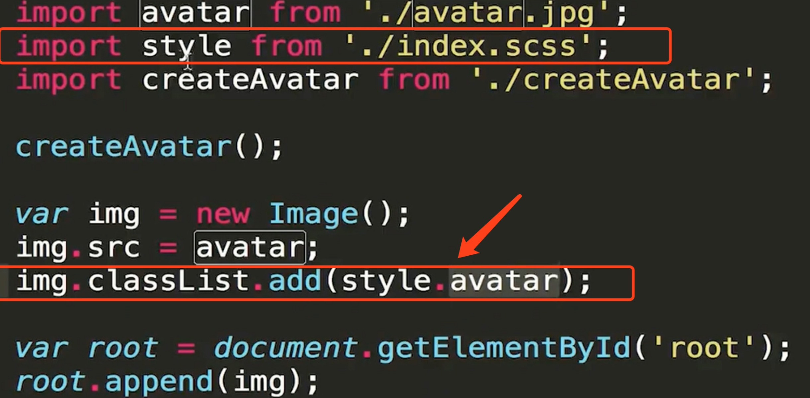
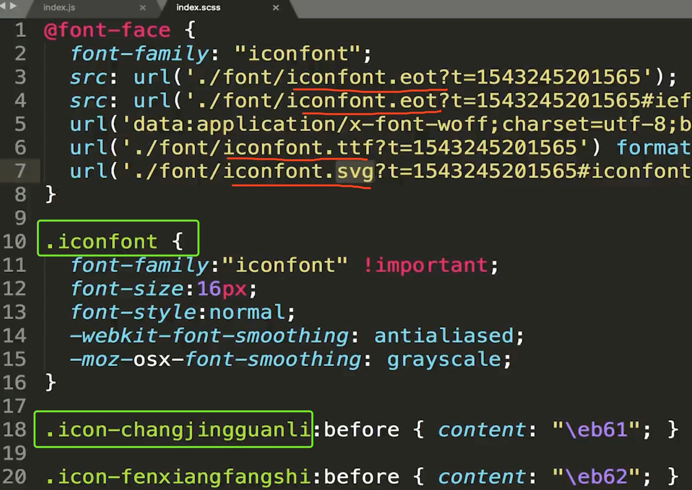
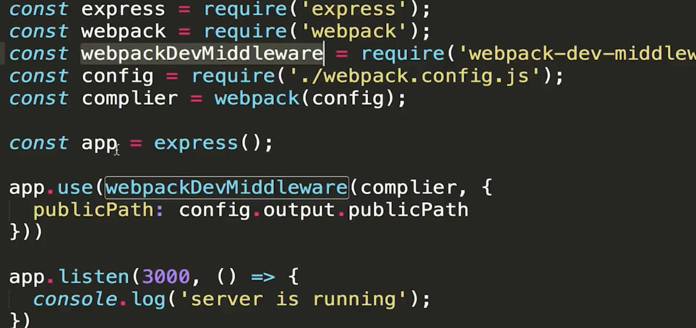
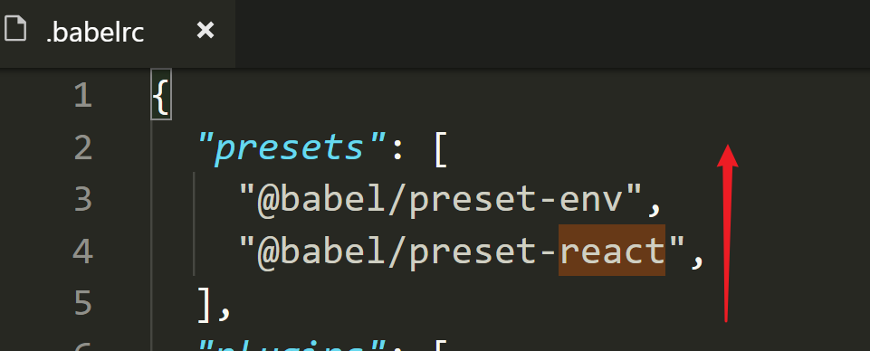
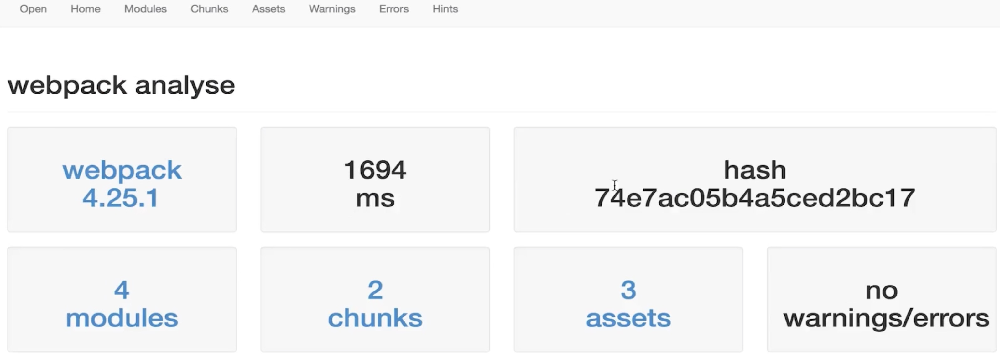

我的webpack学习笔记。
从webpack是什么、各种核心概念(loader、plugins)，高级概念(treeShaking、codeSplitting、代码分析)的学习笔记。
如有错误，欢迎指出~
持续补充学习。

<!-- more -->

#### 目录
1. [webpack初探](#webpack初探)
	1. [webpack是什么](#webpack是什么)
	1. [webpack怎么用](#webpack怎么用)
1. [webpack中的核心概念](#webpack中的核心概念)
	1. [entry与output](#entry与output)
	1. [loader](#loader)
	1. [plugins](#plugins)
	1. [sourcemap](#sourcemap)
	1. [devServer](#devServer)
	1. [babel](#babel)
1. [webpack高级概念](#webpack高级概念)
	1. [treeShaking](#treeshaking)
	1. [mode](#mode)
	1. [codeSplitting](#codesplitting)
	1. [splitChunksPlugin](#splitchunksplugin)
	1. [打包分析](#打包分析)
	1. [css代码分割](#css代码分割)
	1. [Shimming的作用](#shimming的作用)


# webpack初探
## webpack是什么
google webpack：
> webpack is a module bundler.

所以，可以理解为它是模块打包工具。可以把多个模块打包到一起。

模块可以是js、css、图片文件。

浏览器不认识import这种写法（ES6 or 更高级），所以需要webpack来打包编译成浏览器认识的代码。

webpack4相比之前
① 速度更快，大型项目节约90%构建时间
② 内置了更多默认配置，变更了许多API

文档直达：
[Module](https://webpack.js.org/configuration/module)
[Module Methods](https://webpack.js.org/api/module-methods)
[Module Variables](https://webpack.js.org/api/module-variables)

## webpack怎么用
### 安装
1、首先你得安装了node和npm，一般安装了node能用npm命令；
2、webpack可全局安装也可根据项目本地安装；
全局安装则 `npm i webpack webpack-cli -g`；
本地安装则：`npm i webpack webpack-cli --save-dev`（或`npm i webpack webpack-cli -D`，等价的）；
>建议本地安装，因为如果遇到两个项目使用的webpack版本不一样的时候可能会出问题；
>安装webpack-cli是为了能在命令行中使用webpack命令。

3、如果是全局安装，那么打包命令为`webpack index.js`
如果是本地安装，那么为：`npx webpack index.js`
或者利用npm scripts,在package.json中的script处配置：`"build": "webpack"`,然后直接跑命令`npm run build`即可
>`npx`是可以获取到当前项目工程目录下的node_modules中的webpack；
配置npm scripts的命令webpack调用的是本地安装的webpack，所以不用加`npx`了。
另外，如果写好了配置文件，那就不需要加index.js了。直接写webpack即读取配置文件，按配置文件(看下一part)配置规则进行打包操作。


### 配置文件
简单的配置：
```
const path = require(path); // 引入node的核心模块

module.exports = {
  mode: 'development',
  entry: './index.js',  // 入口文件
  output: { // 输出文件配置
    filename: 'bundle.js',  // 打包后的文件名
    path: path.resolve(__dirname, 'dist'); // 目标文件夹,默认dist,要是绝对路径
  }
}
```
> webpack有默认配置文件，名字默认是webpack.config.js.
要改名字也行，如改成webpack.config.dev.js,那么命令改为：`webpack --config webpack.config.dev.js`.

> 配置文件是用CommonJS语法.
`__dirname` 指的是webpack配置文件所在的当前目录的路径.

> mode development是开发环境，打包出来的文件不会被压缩。production是生成环境，打包出来的文件会被压缩

[回到顶部](#目录)

# webpack中的核心概念
## entry与output
```
module.export = {
  entry: {  // 多入口，多页
    main: './src/index.js',
    sub: './src/index.js',
  },
  output: {
    // 占位符对应上面的main/sub，打出两个包
    // contenthash是文件hash，文件改了就改
    filename: [name][contenthash].js,
    path: path.resolve(__dirname, 'dist'),
    publicPath: 'https://cnd.com',  // 自动给打包后的文件路径前面加指定路径
  }
}
```
> `publicPath`: 当静态资源要放到cdn上时，需要动态加cdn域名，就可以配置这个参数。然后打包出来的html文件中引入的bundle文件前面的域名就是所配置域名；

文档直达：
[output](https://webpack.js.org/configuration/output)、[output-management](https://webpack.js.org/guides/output-management)

[回到顶部](#目录)

## loader

webpack默认可以打包js文件，但是它不懂怎么打包图片文件，所以需要在配置文件中告诉webpack怎么打包；就需要引入loader。

loader是打包方案，告诉webpack该如何打包某些特定文件；

```
const path = require(path); // 引入node的核心模块

module.exports = {
  ...
  module: { // webpack不懂处理的模块，就配置相应的loader来处理
    rules: [{
        test: /\.jpg$/, // 匹配到jpg结尾的，图片文件
        use: {
          loader: 'file-loader'  // 就使用该loader处理
        },
        options: {
          // placeholder 占位符
          name: '[name][hash].[ext]', // 自定义文件名
          outputPath: 'images/',  // 指定文件夹，即放在dist/images里
          limit: 2048 // 图片大于2048字节(2Kb)，则像file-loader一样打包出文件，小于则成base64
        }, {
          test: /\.scss$/,  // 样式文件
          use: [
            'style-loader',
             {
               loader: 'css-loader',
               options: {
                 importLoaders: 2, // 通过@import引入的css文件也经历下面2个loader
                 modules: true // 开启css模块化打包
               }
             },
            'sass-loader',
            'postcss-loader']
        }, {
          test: /\.(eot|ttf|svg)$/,  // 字体文件
          use: {
            loader: 'file-loader'
          }
        }
      }]
  }
  ...
}
```

```
// 使用多个loader可以用use
use: [{
  loader: 'babel-loader'
}, {
  loader: 'import-loader?this=>window' // this默认指向当前模块，这样配置可以把this改成window
}]
```

#### 打包图片
###### file-loader & url-loader

> file-loader 把匹配到的文件生成一份新的并移动到dist下，并给 引用到该文件的地方 返回此文件的路径

>ps： `file-loader` 可以换成 `url-loader`
`url-loader`会把图片转换成base64，然后直接写进打包好的bundle文件里，而不是直接生成一个文件放到dist里。
当图片比较小的时候非常适合用url-loader，节省http请求；
但是图片很大的时候用url-loader的话会导致打包的js文件很大，加载就很慢。

文档直达：
[file-loader](https://webpack.js.org/loaders/file-loader)、[url-loader](https://webpack.js.org/loaders/url-loader)、[placeholder](https://webpack.js.org/loaders/file-loader/#placeholders)

#### 打包样式

> 匹配到scss文件后缀时，使用一堆loader，loader的使用顺序是 从下到上，从右到左(`postcss-loader -> sass-loader -> css-loader -> style-loader`);

##### css-loader & style-loader

>`css-loader`: 分析出几个css文件的依赖关系，把css文件合并成一段css
`style-loader`： 得到css-loader生成的css内容之后，style-loader会把这段内容挂在到页面的`<head>`部分


##### postcss-loader + autoprefixer插件
> 自动添加厂商前缀(-webkit-之类)的loader。
需要添加`postcss.config.js`文件


##### options中的importLoaders配置
这里的 `importLoaders: 2` 代表css文件中通过@import方式引入的那些css文件 也要走下面两个loader，如果不配置，就只从css-loader开始走，从下往上走了，
sass-loader）开始走。

##### css模块化
在options处配置`modules: true`,然后就可以如下图使用：
保证了我这个模块里的样式 和 其他模块文件里的样式 不会有任何耦合冲突。写样式的时候就可以很独立，避免出错。


更多的还有有sass-loader、less-loader等；

文档直达：
[css-loader](https://webpack.js.org/loaders/css-loader)、[style-loader](https://webpack.js.org/loaders/style-loader)、[postcss-loader](https://webpack.js.org/loaders/postcss-loader)、[importLoaders](https://webpack.js.org/loaders/css-loader#importloaders)


##### 打包字体文件
使用`file-loader`即可。



ps: 字体图标网站：[www.iconfont.cn](https://www.iconfont.cn/)

文档直达：
[Asset Management](https://webpack.js.org/guides/asset-management)

[回到顶部](#目录)

## plugins
plugin可以再webpack运行到某个时刻，在打包节点帮你做一些事情。
类似在webpack某生命周期下，就可以用plugins为webpack 做一些事情。

```
const HtmlWebpackPlugin = require('html-webpack-plugin');
const CleanWebpackPlugin = require('clean-webpack-plugin');
module.exports = {
  ...
  plugins: [
    new HtmlWebpackPlugin({
      template: 'src/index.html' // 提前准备好模板文件
    }),
    new CleanWebpackPlugin(['dist'])  // 打包之前删除dist文件
  ]
  ...
}
```

##### html-webpack-plugin
在打包结束后，自动生成一个html文件 放到dist中，并将打包好的bundle.js注入到这个html文件中。

##### clean-webpack-plugin
在打包之前，删除某文件夹

文档直达：
[html-webpack-plugin](https://webpack.js.org/plugins/html-webpack-plugin)、[clean-webpack-plugin](https://www.npmjs.com/package/clean-webpack-plugin)

[回到顶部](#目录)

## sourcemap
sourceMap是一种映射关系，可以把目标生成代码映和源代码的映射起来。

##### 解决的问题：
当我们打包生成的代码 出错的时候， 如果不用sourcemap,我们只能知道打包生成的代码 第几行出错，而不能知道对应的源代码哪行出错。
sourceMap存储目标打包代码和源代码的映射关系就能在代码出错时获得源代码的出错位置。


```
module.exports = {
  ...
  devtool: 'source-map'
  ...
}
```
关键词：`inline`, `cheap`, `module`, `eval`

###### source-map
> 当配置成`source-map`时，dist里会看到有一个`.map`文件，存储着目标生成代码和源代码的映射关系。

###### inline-source-map
> 当配置成`inline-source-map`时，`.map`文件会变成base64放到打包好的bundle的底部。出错时，会告诉开发者哪一行哪一列出错。

###### cheap-inline-source-map
> 当配置成`cheap-inline-source-map`时，只会告诉是哪一行出错。
打包的时候只用计算行而不用计算列，这样打包的性能会有提升。
另外，cheap-xxx的配置只针对业务代码，不会管第三方代码库。

###### cheap-module-inline-source-map
> 当配置成`cheap-module-inline-source-map`时，代表打包不止针对业务代码，第三方代码库也会处理。

###### eval
> eval是打包速度最快的一种方式。通过eval这种方式加上sourceUrl，来形成sourceMap这种对应关系。


执行效率最快，性能最好。
但是对于复杂代码，提示可能不全面。


##### 建议
开发环境(development)使用 `cheap-module-eval-source-map`,提示比较全，打包也相对比较快。
生成环境(production)使用 `cheap-module-source-map`

文档直达：
[sourcemap](https://webpack.js.org/configuration/devtool/#root)

[回到顶部](#目录)

## devServer

为了方便改动代码后能自动打包编译，有几种解决方案:
1、`webapck --watch`(在命令行中使用webpack)
缺点：需手动刷新页面
2、`webpack-dev-server`
即可自动更新浏览器。
用devServer开启一个web服务器(是http的，就可以正常发请求了)
需安装包`webpack-dev-server`,再在npm scripts处配置；eg: `"start": "webpack-dev-server"`
```
...
devServer: {
  port: 9000, // 服务端口号
  contentBase: './dist',  // 代表服务要起在哪个文件夹下（服务器的根路径）
  open: true, // 起服务的时候自动打开页面
  proxy: ...  // 跨域接口mock的时候做接口代理
}
...
```

3、自己写server.js(在node中直接使用webpack)
简单的配置也需手动刷新页面，但是可以安装热更新的一些插件解决。
一个简单的server.js:

然后npm scripts配置：`"server": "node server.js"`


#### 补充学习`webpack-dev-server`：
webpack-dev-server打包编译出来的dist，在项目目录里是看不见的。它生成的文件是存在电脑内存里的，这样有效提升打包速度，让开发更快。

文档直达：
[Development](https://webpack.js.org/guides/development)、[Command Line Interface](https://webpack.js.org/api/cli)、[Node API](https://webpack.js.org/api/node)

#### hot module replacement

开启HMR功能：
```
...
devServer: {
  ...
  hot: true, // 让webpack开启HMR
  hotOnly: true, // 保证浏览器不自动刷新,入口那里去module.hot判断
}
plugins: [
  ...
  new webpack.HotModuleReplacementPlugin() // 热模块替换
]
...
```

入口文件处加上：
```
if(module.hot && process.env.NODE_ENV !== 'production') {
  module.hot.accept();
}
```

解决的问题：
不会刷新页面，改css的时候就单纯替换样式，改js的时候也只替换改动过的地方，方式调试；

文档直达：
[Hot Module Replacement](https://webpack.js.org/guides/hot-module-replacement)、[HotModuleReplacementPlugin](https://webpack.js.org/plugins/hot-module-replacement-plugin)

[回到顶部](#目录)

## babel

##### 如果你写的是业务代码，那么你可以这样配置就行：

需要装的包：
`babel-loader` `@babel/core` [`@babel/preset-env`](https://babeljs.io/docs/en/babel-preset-env) `@babel/polyfill`

```
...
module: {
  rules: [
    ...
    {
      test: /\.js$/,
      include: path.resolve(__dirname, '../src'), // src下的要使用该loader
      exclude: /node_modules/, // node_modules不使用该loader
      loader: 'babel-loader',  // es6转es5的loader
      // 这里做个配置：
      options: {
        presets: [['@babel/preset-env', {
          useBuiltIns: 'usage',  // 当做babel-polyfill填充时，加低版本浏览器不支持的特性变量时，不是所有的都加，用到的才加。
          targets: {
            chrome: "67" // 代表大于67的浏览器就不用去做babel转换了，因为支持足够好了
          }
        }]]
      }
    },
    ...
  ]
}
...
```

> @babel/preset-env 转换ES6代码，包含了所有es6转es5的翻译规则
安装这个之后还得做一个配置：
```
// .babelrc 或者 像上面一样配置在options里
{
  "presets": ["@babel/preset-env"]
}
```
> 借助 @babel/polyfill 为了兼容低版本浏览器。把低版本浏览器缺失的变量、函数填充到浏览器里。
配置 `useBuiltIns` 则不是全都添加，用到的才加。（这样打包出来的文件会小一些，提升打包效率）
配置`targets`，符合条件的浏览器不用打包也可以提升效率。
@babel/polyfill 可能会污染全局环境,因为实现是把变量放在window上，所以不适合给库代码配置。

如果用了useBuiltIns的配置就不用自己引入@babel/polyfill了，会自动引入。就不用自己去`import '@babel/polyfill'`了


##### 如果你写的是一个类库代码，那么你可以这样配置：
其他安装包：
`@babel/plugin-transform-runtime` `@babel/runtime` `@babel/runtime-corejs2`

```
...
module: {
  rules: [
    {
      test: /\.js$/,
      exclude: /node_modules/,
      loader: 'babel-loader',
      options: {
        'plugins': [['@babel/plugin-transform-runtime', {
          'corejs': 2,
          'helpers': true,
          'regenerator': true,
          'useESModules': false,
        }]]
      }
    }
  ]
}
...
```
> @babel/plugin-transform-runtime 和polyfill的区别是它会以闭包的形式去引入，不会污染全局。

ps: babel-loader下的options中配置的那些代码可以统一放到`.babelrc`文件中。让配置文件更简单简洁。

顺序不能反，执行顺序从下往上，从右往左


> @babel/preset-react 转换react代码

文档直达：
[babel installation](https://babeljs.io/setup#installation)、
[回到顶部](#目录)

## webpack高级概念
### treeshaking
摇树，即意思是 把没用过的都摇掉，即只打包用过的代码；
Tree Shaking 只支持ES Module（只支持import引入，即静态引入，不支持require引入(动态引入)）
但是有不想被摇掉的文件比如样式文件，就配下`usedExports`和`sideEffects`

```
// development 配置
...
optimization: {
  usedExports: true // 哪些模块使用了才打包
}
...
```

package.json中也要加代码(配置不要Tree Shaking的文件)：
```
{
  ...
  // css文件一般就是单纯的引入，但是是要用的，别把样式文件摇掉了
  "sideEffects": ["*.css"],
  ...
}
```

如果是production环境，默认有treeShaking了，所以不用配置`usedExports`
没有不要Tree Shaking的，则配 `"sideEffects": false` ，生产环境也要配`sideEffects`；

开发环境下，Tree Shaking 后的代码 也不会被删掉，为了保证代码行数不变。生产环境就会删掉。
[回到顶部](#目录)

### mode
development & production

搞两个配置文件，`webpack.config.dev.js`，`webpack.config.prod.js`
并且把公共的配置抽出来放在`webpack.config.base.js`里
然后用`webpack-merge`来分别合并base到dev和prod里。
然后package.json处配：
```
{
  ...
  "script": {
    "dev": "webpack-dev-server --config webpack.config.dev.js",
    "build": "webpack --config webpack.config.prod.js"
  }
  ...
}
```
```
// eg: dev配置
const merge = require('webpack-merge');
const baseConf = require('./webpack.config.base.js');
const devConf = {
  ...
};

module.exports = merge(baseConf, devConf); // 合并base和dev；prod同理；

```

ps： 一般会创建一个build文件夹，把这3个配置文件移动到build里。这样的话你把package.json那边的路径改一下。还有，得改base配置里的output路径和 CleanWebpackPlugin 的路径。

```
···
CleanWebpackPlugin(['dist'], {  // dist是相对root的路径，所以不用写成'../dist'
  root: path.resolve(__dirname, '../')
})
···
```
[clean-webpack-plugin](https://github.com/johnagan/clean-webpack-plugin)

#### 环境变量
不分别在dev 和 prod 中做merge了。
在base里加上：
```
module.exports = (env) => {
  if(env && env.production) {
    return merge(baseConf, prodConf);
  } else {
    return  merge(baseConf, devConf);
  }
}
```
然后package.json中去传环境变量
```
"dev": "webpack-dev-server --config ./build/webpack.config.base.js"
"build": "webpack --env.production --config ./build/webpack.config.base.js"
```


[回到顶部](#目录)

### codesplitting
代码分割

问题：
如果把库代码和业务代码打包在一起，那么，
打包文件会很大，加载时间会很长；
当业务代码变更，又得经历很长的加载时间

对代码公用部分进行拆分，来提升项目运行的速度  ——  code splitting

```
...
optimization: {
  splitChunks: {  // 代码分割 webpack4加的，以前可用插件
    chunks: 'all'
  }
}
...
```
通过合理的代码分割，可以让我们的项目运行的性能更高。
代码分割的概念，没有webpack也存在，我们得思考如何分割和自己手动去分割。有了webpack可以做自动分割。

webpack中实现代码分割两种方式：
1、同步代码：只需在webpack配置中做optimization的配置即可。
2、异步代码(import)：无需做任何配置，会自动进行代码分割，放置到新的文件中。
```
funtion getElement() {
  // 异步加载库，需要用到包：@babel/plugin-syntax-dynamic-import
  return import(/* webpackChunkName:"lodash" */ 'lodash').then(({default: _}) => {
    var elem = document.createElement('div');
    elem.innerHTML = _.join([1,2,3], '*');
    return elem;
  })
}
getElement();
```

```

// .babelrc
{ ...
  "plugins": ["@babel/plugin-syntax-dynamic-import"]
...}
```

[回到顶部](#目录)


### splitchunksplugin
上一part代码中的`/* webpackChunkName:"lodash" */ `是魔法注释（Magic Comment），如果不加，生成的lodash包会使一个code split之后自动产生的一个id名字，设置了这个可以自定义命名。现在打包出来的名字叫`vendor~lodash.js`,如果就像叫lodash，可以改下配置：
```
...
optimization: {
  splitChunks: {
    chunks: 'all',
    cacheGroups: {
      vendors: false, // 这样打包出来的就不会有vendor~了
      default: false
    }
  }
}
...
```
[SplitChunksPlugin](https://webpack.js.org/plugins/split-chunks-plugin)

```
// webpack SplitChunksPlugin 默认的配置：
optimization: {
  splitChunks: {
    chunks: 'async', // 代表只对异步代码生效；(initial:同步，all:都做)
    minSize: 30000, // 大于30kb的模块才做代码分割
    maxSize: 0, // ，配了n，包允许的话可进行多次分割，每个包大小不大于n
    minChunks: 1, // 当一个模块 被n个chunk使用 之后才进行代码分割(使用n次？)
    maxAsyncRequests: 5, // 同时加载的模块数最多是5个
    maxInitialRequests: 3, // 入口文件引入的文件做代码分割不超过3个文件
    automaticNameDelimiter: '~', // 下面那个命名的中间分隔符
    name: true, // cacheGroups里的命名有效
    cacheGroups: { // 分组
      vendors: { vendor组
        test: /[\\/]node_modules[\\/]/, // 检测要打包库的是否在node_modules里
        priority: -10, // 优先级
        filename: 'vendors.js' // 命名，不配的话自动名为vendor~main.js (这个main和entry的那个对应)
      },
      default: { default组
        minChunks: 2,
        priority: -20,
        reuseExistingChunk: true,//如果一个模块已经被打包过了，就不会重复打包
        filename: 'common.js' // 命名，不配置的话为default~main.js(组名~入口模块名)
      }
    }
  }
}
```
[回到顶部](#目录)


### LazyLoading&Chunk
懒加载, 通过 import 来异步加载模块.当用到了某模块的时候才去加载该模块；

打包出来的每一个文件就是一个Chunk；

### 打包分析
preloading & prefetching

[webpack analyse](https://github.com/webpack/analyse)
package.json:
`"dev": "webpack --profile --json > stats.json webpack.config.dev.js"`
这样打包之后就会有一个stats.json文件放打包的描述了，就可以拿去这个网站：[analyse](https://webpack.github.com/analyse) 上做分析了:


还可以装插件去做分析：
`webpack-bundle-analyzer`

前端代码性能提升：
1、缓存，但是可以带来的代码性能提升非常有限，首屏加载的时候还是一样慢。
2、提高代码利用率。利用异步加载（懒加载），懒加载会牺牲一些用户体验，那么可以用prefetch来解决。

##### 如何查看代码利用率？
1、打开控制台
2、window:ctrl+shift+p; mac:command+shift+p;
3、选show Coverage，就可以查看代码利用率啦


[Prefetching/Preloading modules](https://webpack.js.org/guides/code-splitting/#prefetchingpreloading-modules)


###### Prefetching
在网络空闲的时候偷偷加载暂时用不到的模块，当要用的时候也不会慢了，在首屏的时候也不会阻碍重要模块的加载
```
// 首屏用不上LoginModal，所以可以异步去加载
// 但是，当主要的模块都加载完之后
// 网络空闲时，就可以去加载LoginModal这个模块,
// 把之后要用的也预先加载好，这样要用的时候才会快
import(/* webpackPrefetch: true */ 'LoginModal'); // 加上这个魔法注释是关键！
```

###### PreLoading
```
//...
import(/* webpackPreload: true */ 'ChartingLibrary');
```

> A preloaded chunk starts loading in parallel to the parent chunk.
A prefetched chunk starts after the parent chunk finishes loading.
(preload 是和主要模块并行加载的。 prefetch 是在主要模块加载完之后网络空闲期间加载的)

[回到顶部](#目录)

### css代码分割
webpack打包css文件的时候是会把css打包进js文件里的（css in js）；如果不想打包到一起，可以用以下的插件：

[MiniCssExtractPlugin](https://webpack.js.org/plugins/mini-css-extract-plugin)
不支持HRM(热替换)，所以一般在prod环境配置；css就会被单独打包出来
同时，引入`optimize-assets-webpack-plugin`插件,可以压缩css
```
// prod
const MiniCssExtractPlugin = require("mini-css-extract-plugin")
const OptimizeCSSAssetsPlugin = require('optimize-css-assets-webpack-plugin');
...
module: {
  rules: [{
    test: /\.scss$/,
    use: [
      MiniCssExtractPlugin.loader,  // style-loader替换为该loader，使css被单独打包出来
      options: {
        importLoaders: 2
      },
      'sass-loader',
      'postcss-loader'
    ]
  }]
},
optimization: {
  minimizer: [
    new OptimizeCSSAssetsPlugin({}) // 压缩合并css，记得传入空对象
  ],
  runtimeChunk: {
    // 老版本webpack需配置，保证文件没改contenthash不会变
    // 抽离manifest到runtime的一个文件里去，主要是存储业务代码和库代码的对应关系
    name: 'runtime'
  }
  splitChunks: {
    cacheGroups: {
      styles: { // styles 组
        name: 'styles',
        test: /\.css$/,  // 只要匹配到css文件(多页也一样)，统一打包到一个文件(styles.css)
        chunks: 'all',
        enforce: true
      }
    }
  }
}
...

```
[回到顶部](#目录)

### shimming的作用
垫片，处理webpack打包中的兼容性问题。
```
...
plugins: [
  new webpack.ProvidePlugin({
    $: 'jquery' // 没有import的那些 也能用这个变量
    _join: ['lodash', 'join'] // 自定义的
  })
]
...
```
[回到顶部](#目录)

### 性能优化
#### 提升webpack打包速度的方法
1.跟上技术的迭代(Node,Npm,Yarn)
2.尽可能让Loader的作用范围变小(合理使用include和exclude可以降低loader的执行范围和频率，从而提高打包速度)
3.Plugin尽可能精简并确保可靠(选官方推荐的插件，可靠性、性能得到验证的)
4.resolve 参数合理配置
```
...
resolve: {
  extensions: ['.js', '.jsx'], // 可省略的文件后缀
  mainFiles: ['index', 'test'],
  alias: {
    @component: path.resolve(__dirname, 'component')
  }
},
...
```
> 一般规定，extensions里最好别配css文件之类的资源类文件。
开发文件的时候你不想写文件后缀可以在这里配，都是配的多了，会调用很多次文件的查找，调用nodejs底层文件操作，会有性能损耗。
所以一般.js、.jsx、.vue这种逻辑性文件才配。

> mainFiles: import某文件夹时，没有指定某文件，会先引index，没有的话，就引test，还没有才报错，不过一般不配置这个，会让打包速度变慢.

> alias: 设置别名，就可以直接`import xx from '@component/xx';`

5.使用DllPlugin提高打包速度
目标：让第三方模块只打包一次(不怎么变得包就打包一次，存在dll中，下次还用就去dll取)，加快打包速度。

eg:
把react/react-dom/lodahs打包到一个叫vendors.dll.js的文件中.
新增`webapck.dll.js`文件
```
// webapck.dll.js
const path = require('path');
const webpack = require('webpack');

module.exports = {
  mode:'production',
  entry: {
    vendors: ['react', 'react-dom', 'lodash'] // 要抽出来的第三方库
  },
  output: {
    filename: '[name].dll.js', // 单独打包生成dll文件
    path: path.resolve(__dirname, '../dll'),
    library: '[name]' // 配置library把打包的第三方代码通过全局变量形式暴露出去
  },
  plugins: [
    // 对暴露的dll代码做分析，生成一个vendors.manifest.json映射文件
    // 方便分析引入的库是否是不用重新打包的
    new webpack.DllPlugin({
      name: '[name]',
      path: path.resolve(__dirname, '../dll/[name].manifest.json'),
    })
  ]
}
```

在把生成的这个文件注入的html中；
```
// base配置文件中添加代码：
const AddAssetHtmlWebpackPlugin = require('add-asset-html-webpack-plugin');

...
plugins: [
  ...
  // 帮忙往html注入dll，也是往全局注入
  new AddAssetHtmlWebpackPlugin({
    filepath: path.resolve(__dirname, '../dll/vendors.dll.js')
  }),
  // 这个就是作分析的那个插件了
  // 去vendors.manifest.json找映射关系
  // 用配过的第三方库的时候就去全局直接拿(即拿vendors.dll.js中的)。
  // 否则，去node_modules找，重新打包
  new webpack.DllReferencePlugin({
    manifest: path.resolve(__dirname, '../dll/vendors.manifest.json')
  })
  ...
]
...
```
最后，package.json中增加script命令
```
"build:dll": "webpack --config ./build/webpack.dll.js"
```
————
如果需要对dll中的第三方库进行拆分，也就是entry多入口。那么得写多个 new AddAssetHtmlWebpackPlugin和new webpack.DllReferencePlugin，那么可以借助node来动态加入配置。
```
const fs = require('fs'); // 引入node的核心模块

// 先把基础plugins抽出：
const plugins = [
  new HtmlWebpackPlugin({...}),
  ...
];
const files = fs.readdirSync(path.resolve(__dirname, '../dll'));
files.forEach(file => {
  if(/.*\.dll.js/.test(file)) {
    plugins.push(new AddAssetHtmlWebpackPlugin({
      filePath: path.resolve(__dirname, '../dll', file)
    }))
  }
  if(/.*\.manifest.json/.test(file)) {
    plugins.push(new DllReferencePlugin({
      filePath: path.resolve(__dirname, '../dll', file)
    }))
  }
})

// 配置里
...
plugins: plugins,
...
```
6.控制包文件大小
7.thread-loader,parallel-webpack,happypack多进程打包
8.合理使用sourceMap
9.结合 stats 分析打包结果
10.开发环境内存编译
11.开发环境剔除无用插件


<!-- ## 实战
### Library
### PWA
### Typescript
### webpackDevServer（请求转发、单页路由）
### Eslint
### 性能优化


## 原理
### 如何编写一个Loader
### Bundler源码编写

## 脚手架分析
### CreateReactApp

### vue-cli3 -->
